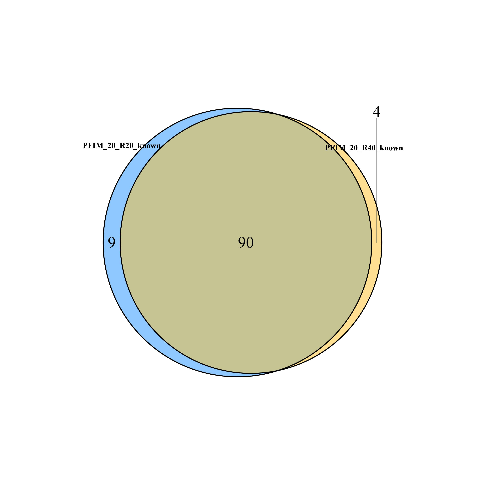
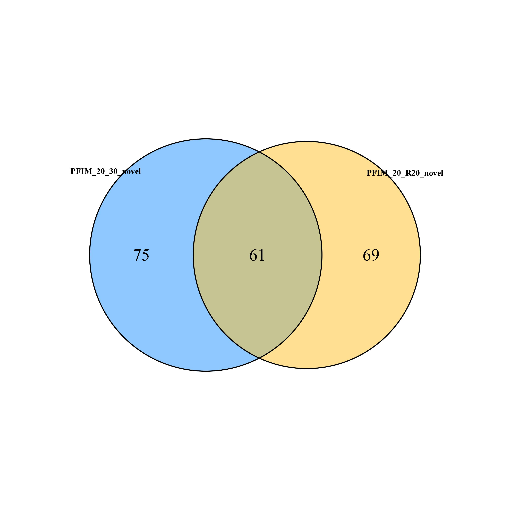

#  S (small) Bioinformatics Tools

### Populations diversity 

#### Reference

- N. Rochette & J. Catchen. [Deriving genotypes from RAD-seq short-read data using Stacks](https://www.nature.com/articles/nprot.2017.123). Nature Protocols, 12:2640–2659, 2017
- Jianbo He, Shan Meng, Tuanjie Zhao, Guangnan Xing, Shouping Yang, Yan Li, Rongzhan Guan, Jiangjie Lu, Yufeng Wang, Qiuju Xia, Bing Yang, Junyi Gai, [An innovative procedure of genome-wide association analysis fits studies on germplasm population and plant breeding](https://link.springer.com/article/10.1007%2Fs00122-017-2962-9), Theor Appl Genet, 2017, 130: 2327-2343. doi: 10.1007/s00122-017-2962-9

#### Bowtie
* MAPPING
> $ cd /mnt/ilustre/centos7users/meng.luo/project/yuanjie_MJ20190619038/bowtie/1/ && bowtie -f -n 0 -e 80 -l 18 -a -m 5 --best --strata --al M.clean.1.mapped --un M.clean.1.unmapped M.clean.1.fa /mnt/ilustre/centos7users/meng.luo/project/yuanjie_MJ20190619038/04.bam-sort/Z.sort.mapped.bam.fa M.clean.1.bwt 2> M.clean.1.log && bowtie2 -x ../virus_ref/ref_index -U /mnt/ilustre/users/penny.yang/newmdt/workspace/project/smallRNA/ouyangwei_MJ20180628103/pipe/fastq_QC/IBDV_2/IBDV_2.filted.trimmed.len.fa -f -S IBDV_2/IBDV_2.sam

* GET STAT RESULT
> $ paste <(grep "bash" qsub.*.sh) <(grep "reads; of these" qsub.*.e*) <(grep "aligned concordantly exactly" qsub.*.e*) | cut -d ' ' -f3,10,11 | sed 's/qsub.*://g' | sed 's/ /\t/g;s/(//g;s/)//g' | awk -vOFS='\t' 'BEGIN{print "Sample","Total Reads", "Mapped Reads", "Mapped Ratio"}{print $1,$2*2,$3*2,$4}' > map.stat.xls

#### samtools
* get unique mapped result from bam
> $ samtools view -q 255 Z.sort.mapped.bam > Z.sort.mapped.bam.uniq.table && samtools view -c -q 255 -F 0x2 Z.sort.bam >Z.sort.mapped.bam.uniq.table

### VENN plot

Required INSTALL VennDiagram R package 
 ```r
> install.packages("VennDiagram")
> library(VennDiagram)
```
#### examples



